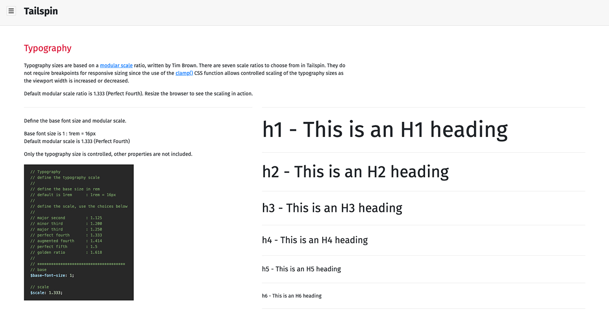

# Tailspin

Tailspin is a customizable, class-based, utility-first CSS library that helps you work within the constraints of a unified system, instead of littering style sheets with arbitrary values. It’s purpose is to help with rapid front-end style development, which is based on consistent design patterns. It can work with any other framework or library such as Bootstrap or React.

Tailspin acts as a single source library of truth, for repeating utility styles in your code.

Skip the boring stuff, and [check out the guide](https://davidloop.github.io/tailspin/).

<p>&nbsp;</p>

***

<p>&nbsp;</p>

### How To Use

<p>&nbsp;</p>

1. **Install using npm.**

```html
npm i tailspin.css
```

<p>&nbsp;</p>

2. **Choose a Tailspin CSS type for your project. You can either use all of Tailspin, or pick and choose multiple or individual utilities, helpers, and/or modifiers. 
Each type has its very own CSS file.**

```html
tailspin-all.min.css
tailspin-helpers-animations.min.css
tailspin-modifiers-border-radius.min.css
tailspin-modifiers-font-size.min.css
tailspin-modifiers-margin-padding.min.css
tailspin-modifiers-opacity.min.css
tailspin-modifiers-z-index.min.css
tailspin-utilities-ratios.min.css
tailspin-utilities-typography.min.css
tailspin-utilities.min.css
```

###### Example
```html
<link rel="stylesheet" type="text/css" href="../prod/css/tailspin-all.css" media="all">
```
<p>&nbsp;</p>

3. **Include the _Fill Media to Container_ javascript file written by [John Ludena](https://github.com/johnludena).**   
This file will work with either **_tailspin-all.min.css_** or **_tailspin-utilities.min.css_**.

```html
tailspin-fill.media.to.container.js
```

###### Example
```html
<script type="text/javascript" src="../prod/js/fill.media.to.container.js"></script>
```

<p>&nbsp;</p>

4. **Add classes to your code.**   
The following code will display a div block, with 30 pixels (converted to rems) of padding, and a border. The paragraph inside the div block has zero margin, and a font size of 20 (1.25rem by default).

```html
<div class="padding-30 border">
  <p class="margin-0 font-size-20">This is a paragraph of text.</p>
</div>
```

<p>&nbsp;</p>

***

<p>&nbsp;</p>

### How To Customize

<p>&nbsp;</p>

Tailspin is a compilation of several individual [SCSS](https://sass-lang.com/) files that run through a set of task modules using [Webpack](https://webpack.js.org/). Customizing Tailspin is a two step process. The first process is modifying a configuration settings [SCSS](https://sass-lang.com/) file called **\_vars.scss**. The second process is compiling all the files using [Webpack](https://webpack.js.org/) and [npm](https://www.npmjs.com/).

<p>&nbsp;</p>

#### Modify The SCSS Settings

Tailspin comes packaged with a settings [SCSS](https://sass-lang.com/) file called **\_vars.scss**.  
This file can be located under **\dev\src\css\settings**.

<p>&nbsp;</p>

The following items are currently available to modify in the Tailspin library.

* **Border Radius** - define the maximum border radius
* **Breakpoints** - defining breakpoint minimum widths
* **Default Border Color** - change the color
* **Font Sizes** - define an incremental value, and maximum font size   
_Example - an incremental value of 2 with a maximum size of 40 will produce 2, 4, 6, 8 … 38, 40_
* **Margins** - define the maximum value needed   
_Example - margin: 0 to margin: 60 and all values in between_
* **Padding** - define the maximum value needed   
_Example - margin: 0 to margin: 60 and all values in between_
* **Typography** - based on an algorithmic scale, you can define a base size, and a predefined scale
* **Z-Index** -  define an incremental value, and maximum z-index   
_Example - an incremental value of 5 with a maximum size of 50 will produce 5, 10, 15, 20 … 45, 50_

<p>&nbsp;</p>

**Here is an example of defining the maximum margin value in the settings file.**   
Changing the **$max-margins** variable will determine the maximum value margins will end at. Below, the margins start at a minumum value of **0**, and will end at a maximum value of **90**, and will produce all values in between (0 through 90).

```scss
// Margin
// define the maximum margin value needed
//
// example: margin: 0px to margin: 90px and all values in between
//
// **************************************
$max-margin: 90;
```

The output from the above setting will produce the following CSS.

```scss
.margin-0 {
  margin: 0rem !important; }
.margin-1 {
  margin: 0.0625rem !important; }
.margin-2 {
  margin: 0.125rem !important; }
  
// ending at ...

.margin-90 {
  margin: 5.625rem !important; }
```

Use the classes in your markup.
```html
<div class="margin-left-right-30">
  <p class="margin-0">This is a paragraph of text.</p>
</div>
```

<p>&nbsp;</p>

#### Naming Patterns

Tailspin classes use a consistent naming pattern with full words, no abbreviations.  
Below are examples of naming patterns and is a small indication of what class names are available.

```html
.margin-5
.margin-left-5
.margin-right-5
.margin-left-right-5
.margin-top-5
.margin-bottom-5
.margin-top-bottom-5

.border-radius-5
.border-radius-6
.border-radius-7
```

<p>&nbsp;</p>

#### Responsiveness

Some, not all, classes come with a responsive naming pattern.  
Below are examples of responsive naming patterns and is a small indication of what class names are available.

```html
.tablet-margin-5
.tablet-margin-left-5
.tablet-margin-right-5
.tablet-margin-left-right-5

.phone-margin-5
.phone-margin-left-5
.phone-margin-right-5
.phone-margin-left-right-5
```

<p>&nbsp;</p>

***

<p>&nbsp;</p>

### Sample Page & Guide

<p>&nbsp;</p>

A [sample page](https://davidloop.github.io/tailspin/) comes packaged with Tailspin that includes all Tailspin functionality, displays explanations with code snippets, and working animation examples. The page is a full guide to using the Tailspin library. The page can also be used to test any modifications made to the **\_vars.scss** settings file on a local development environment, and uses the compiled **development** version of the library.

Check out the [sample page guide here](https://davidloop.github.io/tailspin/).

<p>&nbsp;</p>



<p>&nbsp;</p>
<p>&nbsp;</p>

***

<p>&nbsp;</p>

### Compiling

<p>&nbsp;</p>

There are two different configurations of the compiled SCSS files.

* A version for **development**, used for updates and testing (**webpack.config.dev.js**).
* A version for **production**, which produces the files to add to projects (**webpack.config.prod.js**).

<p>&nbsp;</p>

To compile the **development** version, run the following command within OSX Terminal or Windows Terminal.
```npm
npm run watch
```

<p>&nbsp;</p>

To compile the **production** version, run the following command within OSX Terminal or Windows Terminal.
```npm
npm run build
```

<p>&nbsp;</p>

***

<p>&nbsp;</p>

### Things To Keep in Mind

<p>&nbsp;</p>

* Pixel units are automatically [converted](https://www.npmjs.com/package/postcss-pixels-to-rem) to rem units using [Webpack](https://webpack.js.org/).
* Inline styles will not override Tailspin CSS classes.
* When customizing the **\_vars.scss** settings file, the larger any maximum values are, the larger the compiled CSS file sizes will be.
* There is a separate font-size CSS file, and the typography CSS file. The font-size CSS file is for adding generalized font size classes, and the typography CSS file is for establishing a specific base font size, and automatically sizing heading elements.
* Font size classes can override the heading element sizes, but only if a font size class is added to a heading element.

<p>&nbsp;</p>


